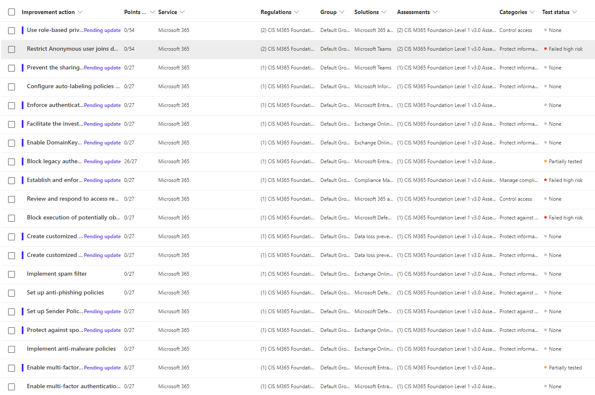
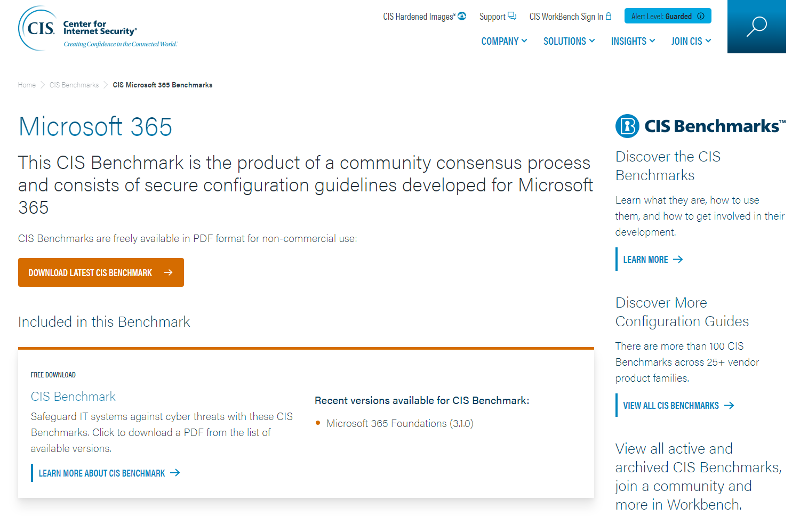
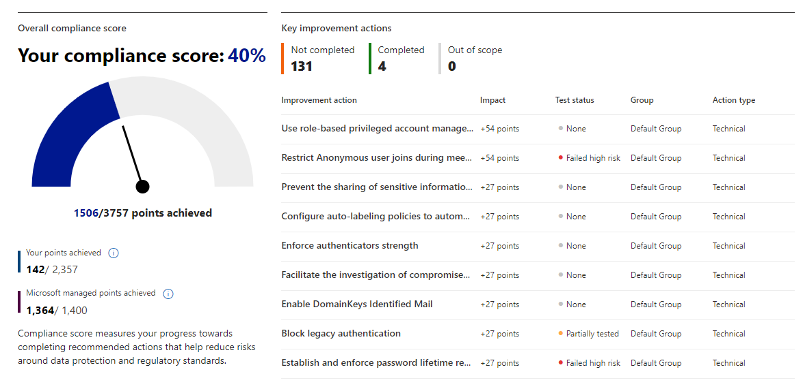

# Implementing CIS Microsoft 365 Foundations Benchmark

## About the service

[Solution Accelerator – Implementing CIS Microsoft 365 Foundations Benchmark](https://duckduckgo.com) เป็นบริการที่ออกแบบมาเพื่อช่วยให้องค์กรของเราปฏิบัติตามมาตรฐานความปลอดภัยที่สำคัญของ CIS Microsoft 365 Foundations Benchmark ซึ่งเป็นแนวทางที่มีเป้าหมายในการปกป้องสภาพแวดล้อมของ Microsoft 365 จากภัยคุกคามทางไซเบอร์ โดยครอบคลุมการกำหนดค่า การควบคุม และการป้องกันในทุกระดับ

## Key benefits

**Compliance with CIS Standards**

องค์กรของเราจะปฏิบัติตามมาตรฐานความปลอดภัยของ CIS Microsoft 365 Foundations Benchmark ที่ได้รับการยอมรับอย่างกว้างขวาง

**Enhanced Data Protection**

ช่วยให้ระบบ Microsoft 365 มีการปกป้องที่ดีขึ้นต่อการโจมตีและภัยคุกคามทางไซเบอร์

**Efficient Implementation**

การปรับใช้ที่รวดเร็วและมีประสิทธิภาพ ช่วยให้องค์กรเริ่มต้นการใช้งานมาตรการป้องกันได้ในเวลาที่สั้นที่สุด

**Tailored for Your Organization**

ปรับแต่งการใช้งานตามความต้องการเฉพาะขององค์กรและสภาพแวดล้อมของ Microsoft 365 ที่มีอยู่

## Methodology

**Initial Assessment**

วิเคราะห์สภาพแวดล้อมของ Microsoft 365 ปัจจุบันเพื่อระบุความเสี่ยงและช่องโหว่

**CIS Benchmark Implementation**

ปรับใช้การตั้งค่าตามมาตรฐาน CIS Microsoft 365 Foundations Benchmark เพื่อเสริมความปลอดภัยให้กับการใช้งาน

**Knowledge Transfer**

ฝึกอบรมทีม IT ขององค์กรในการจัดการและดูแลมาตรการป้องกันที่ถูกปรับใช้

**Post-Implementation Review**

ตรวจสอบและประเมินประสิทธิภาพของการใช้งานหลังจากการปรับใช้เสร็จสิ้น

## Target organizations

องค์กรที่ใช้งาน Microsoft 365 และต้องการเพิ่มความปลอดภัยตามมาตรฐานสากล

## Implementation Timeline

| วัน/ระยะเวลา | กิจกรรม/ขั้นตอนการดำเนินงาน | รายละเอียดงาน |
|---------------|-------------------------------|----------------|
| Day 1 – Kickoff | Kickoff Meeting & Initial Assessment | – แนะนำทีมงานและขอบเขตการทำงาน – วิเคราะห์และประเมินสภาพแวดล้อมของ Microsoft 365 ปัจจุบัน |
| Day 2 | Analyze the collected data | – วิเคราะห์ข้อมูลที่ได้จากการประเมินเบื้องต้น |
| Day 3 | CIS Benchmark Implementation – Phase 1 | – เริ่มปรับใช้การตั้งค่าตาม CIS Benchmark – การตั้งค่าการตรวจสอบการเข้าถึงและการรักษาความปลอดภัยเบื้องต้น |
| Day 4 | CIS Benchmark Implementation – Phase 2 | – ปรับแต่งการตั้งค่าเพื่อเพิ่มการป้องกันข้อมูลและการเข้าถึงระบบ – กำหนดนโยบายการควบคุมสิทธิ์ผู้ใช้งาน |
| Day 5 | Testing & Validation & 2nd Assessment | – ทดสอบการตั้งค่าทั้งหมด – ตรวจสอบการทำงานของระบบแจ้งเตือนและตรวจจับความเสี่ยงทางไซเบอร์ |
| Day 6 | Reporting | – จัดทำรายงานผลการดำเนินงาน |
| Day 7 | Knowledge Transfer & Go Live Close-out meeting | – ฝึกอบรมทีม IT ให้สามารถจัดการการตั้งค่าที่ปรับใช้ – เริ่มใช้งานจริงและมอนิเตอร์ระบบความปลอดภัย |

## Service tiers

|  | Foundation | Standard |
|------------|----------|----------|
| **Duration** | 6 days | 7 days | ระยะเวลาการดำเนินงาน |
| **CIS Benchmark Implementation – Phase 1** | Included | Included | มีการปรับใช้ Phase 1 ในทั้งสองแพ็กเกจ |
| **CIS Benchmark Implementation – Phase 2** | Not included | Included | Phase 2 จะรวมในแพ็กเกจ Standard เท่านั้น |
| **Delivery option** | Remote | Remote | การดำเนินงานเป็นแบบรีโมททั้งสองแพ็กเกจ |
| **Warranty** | 180 days | 180 days | การรับประกันเป็นระยะเวลา 180 วันทั้งสองแพ็กเกจ |

## Deliverables

- รายการสรุป ก่อน และหลังจากการทำ CIS Microsoft 365 Foundations Benchmark
- รับประกัน 180 วัน

## References

- CIS Microsoft 365 Benchmarks
- Center for Internet Security (CIS) Benchmarks
- In the Cloud’s SKUs

## Please contact

- อีเมล์ info@inthecloud.co.th
- โทร +66 (0) 2 017 5220

...
